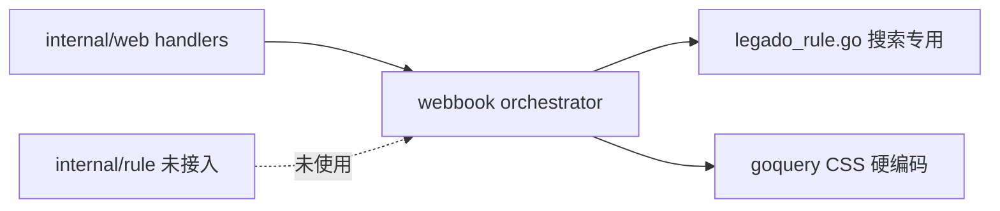
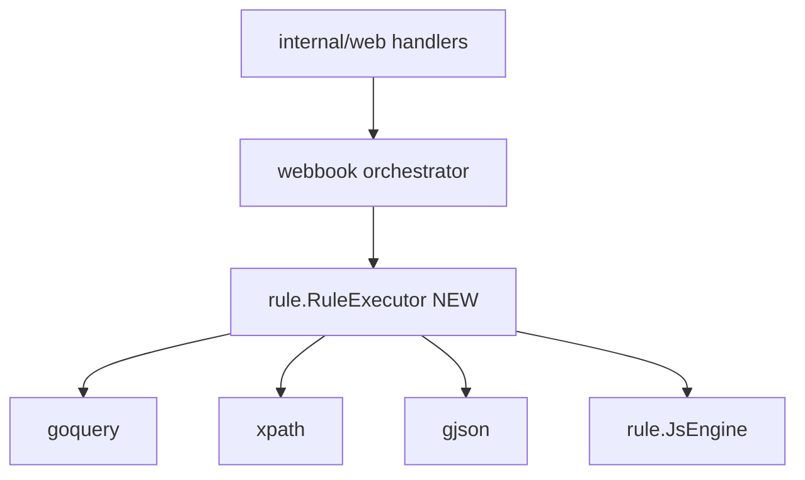
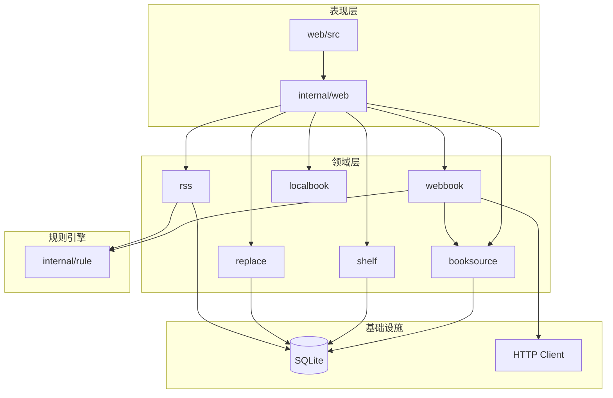

# Reader Go 目标架构

> 返回 [文档索引](./README.md) · 路线图 [ROADMAP.md](./ROADMAP.md)

## 当前 vs 目标

### 当前数据流



### 目标数据流



## 核心设计决策

### 1. RuleExecutor 统一规则执行

**计划路径**：[`internal/rule/executor.go`](../internal/rule/executor.go)

```go
// Execute 根据 mode 与 rule 从 body 中提取结果
Execute(ctx context.Context, mode RuleMode, rule string, body string, vars map[string]string) ([]string, error)
```

职责：

- 串联现有 `QueryXPath` / `ParseCSS` / `QueryJSONPath` / `ParseRegex`
- 调用 `JsEngine.RunEmbeddedJS` 处理 `@js:` 与 `<js>` 片段
- 支持 `&&` / `||` / `%%` 组合（复用 `RuleAnalyzer`）
- 支持 `@put` / `@get` / `{{}}` 内嵌语法（复用 `RuleParser`）

**迁移路径**（已完成）：

1. Phase 2 实现 Executor + 单元测试（`testdata/legado/` fixture）
2. webbook 四流程（search / info / toc / content）+ URL 构建统一走 Executor（[`rule_exec.go`](../internal/webbook/rule_exec.go)）
3. [`legado_rule.go`](../internal/webbook/legado_rule.go) 保留 Legado `@` 链式语法解析，与 Executor 互补
4. ~~[`parseRuleToSelectors`](../internal/webbook/webbook.go)~~ 已删除，由 `parseLegadoFieldRules` 替代

### 2. 书源 DTO 层

**计划路径**：[`internal/booksource/dto.go`](../internal/booksource/dto.go)

- API 层使用 `BookSourceDTO`，字段名与 Legado JSON 1:1（`ruleSearch`、`searchUrl` 等）
- DB model（[`model.go`](../internal/booksource/model.go)）保持 SQLite 列映射
- Handler 负责 DTO ↔ Model 转换，隔离前端与存储

### 3. Schema 迁移

**计划路径**：[`internal/migrate/`](../internal/migrate/)（新建）

- 替代多处 `CREATE TABLE IF NOT EXISTS`
- RSS 表 DDL 从 [`booksource/service.go`](../internal/booksource/service.go) 迁出（见 BACKLOG T-018）
- 版本化迁移：`schema_version` 表 + 递增 SQL 脚本

### 4. webbook 模块边界

| 模块 | 职责 | 不应承担 |
|------|------|----------|
| `webbook` | HTTP 请求编排、并发搜索、缓存 | 规则语法解析 |
| `rule` | 规则解析与执行 | HTTP 客户端 |
| `booksource` | CRUD、导入、持久化 | 网络抓取 |
| `web/handlers` | 路由、参数校验、响应封装 | 业务规则 |

### 5. bookKey 规范

固定格式：`{sourceId}::{url|jsResult}`

- 搜索、书架、阅读器、换源均使用同一格式
- JS 书源 bookUrl 返回 URL 或标识符时，前缀仍为 `sourceId::`

### 6. 替换规则 scope

Phase 2 修复：[`replace/service.go`](../internal/replace/service.go) 在 content / title / toc 路径按 `scope` 过滤后再应用。

当前状态：CRUD 完整，运行时**忽略 scope**。

## 模块依赖图



## 前后端契约（目标态）

| API | 请求/响应要点 | Phase |
|-----|---------------|-------|
| `GET /api/bookSources` | 完整 Legado 字段 + 四个 mode | Phase 1 |
| `GET /api/search?q=` | `bookKey` 格式 `{id}::{url}` | Phase 0 文档修正 |
| `GET /api/book/toc` | `{ chapters: [...] }` 嵌套结构 | Phase 0 前端对齐 |
| `GET /api/book/content` | `{ chapter: { title, content } }` | Phase 0 前端对齐 |
| `POST /api/shelf` | 前端必须调用，不只 Zustand | Phase 0 |
| `PUT /api/shelf/:id/progress` | 阅读进度独立端点 | Phase 0 |
| `GET /api/explore` | 书海发现 | Phase 2 |

## 测试策略

| 层级 | 范围 | 工具 |
|------|------|------|
| 单元 | `internal/rule/*` | Go test + `testdata/legado/` |
| 集成 | webbook 四流程 | HTTP mock + fixture HTML/JSON |
| E2E | 搜索→阅读→书架 | 选手动 + 可选 Playwright |
| 回归 | Legado 合集 26 源 | 导入 + 抽样搜索 |

## 参考实现

- [hectorqin/reader](https://github.com/hectorqin/reader) — Web 版功能对标
- [hectorqin/reader-legado](https://github.com/hectorqin/reader-legado) — Legado 书源格式参考
