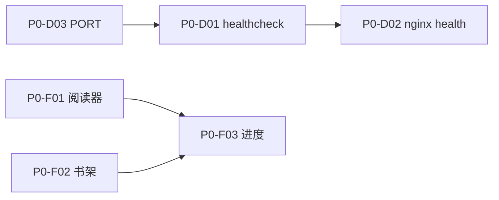

# Phase 0：基础修复（Foundation）

> 返回 [ROADMAP](../ROADMAP.md) · 任务 [BACKLOG](../BACKLOG.md) · 预估 **3–5 天**

**目标**：Docker 可稳定启动，核心阅读链路（搜索 → 目录 → 正文 → 书架）前后端契约对齐。

## 范围

### P0 必做

| ID | 任务 | 文件 | 验收 |
|----|------|------|------|
| P0-D01 | API 镜像安装 `wget` 或 healthcheck 改用 curl/内置 HTTP | [`Dockerfile`](../Dockerfile), [`docker-compose.yml`](../docker-compose.yml) | `docker-compose ps` → api **healthy** |
| P0-D02 | nginx `/health` → `:6464` | [`nginx.conf`](../nginx.conf) L29 | `curl localhost:6465/health` 200 |
| P0-D03 | `main.go` 默认 PORT=6464；文档与 compose 对齐 | [`cmd/server/main.go`](../cmd/server/main.go), [`README.md`](../README.md) | 无 PORT 时监听 6464 |
| P0-F01 | 阅读器：去掉 `.data` 二次解包；TOC 读 `data.chapters`；content 用 `chapter` 字段 | [`web/src/pages/useReader.ts`](../web/src/pages/useReader.ts) | 任选一书：目录列表正常、正文显示 |
| P0-F02 | 书架：加书 `POST /api/shelf`；删除 `DELETE /api/shelf/:id` | [`Bookshelf.tsx`](../web/src/pages/Bookshelf.tsx), [`Search.tsx`](../web/src/pages/Search.tsx) | 加书后 `docker-compose restart` 仍在架 |
| P0-F03 | 暴露 `PUT /api/shelf/:id/progress` | [`internal/shelf/service.go`](../internal/shelf/service.go), [`handlers.go`](../internal/web/handlers.go) | 阅读翻章后刷新进度保留 |

### 增强（同阶段可选）

| ID | 任务 | 说明 |
|----|------|------|
| P0-E01 | compose 增加 `GIN_MODE=release`、`JS_TIMEOUT_MS`、`CACHE_DIR` | 见 [DOCKER.md](../DOCKER.md) |
| P0-E03 | 书源导入返回 `{ imported, failed, errors[] }` | [`service.go`](../internal/booksource/service.go) 改 continue 逻辑 |
| P0-E04 | RSS 页接入链接导入合集 | [`Rss.tsx`](../web/src/pages/Rss.tsx) |

## 实施细节

### P0-F01 阅读器契约

**后端实际响应**（参考 handlers）：

- TOC：`{ code, data: { chapters: [{ title, url, index }] } }`
- Content：`{ code, data: { chapter: { title, content } } }`

**前端修复要点**：

1. axios `unwrap()` 后**不再**访问 `.data.data`
2. `loadToc` 使用 `response.chapters`
3. `loadContent` 使用 `response.chapter.content`

### P0-F02 书架 API 接线

当前 [`useStore.ts`](../web/src/store/useStore.ts) 持久化到 localStorage，换容器/清缓存即丢。

**目标流程**：

```
Search 加书 → POST /api/shelf → 成功后更新 store
Bookshelf 加载 → GET /api/shelf 为主，store 为辅
删除 → DELETE /api/shelf/:id
```

### P0-F03 进度 API

包装现有 `UpdateProgress`：

```
PUT /api/shelf/:id/progress
Body: { currentChapter, chapterIndex, readCount?, lastReadAt? }
```

阅读器 [`Reader.tsx`](../web/src/pages/Reader.tsx) / `useReader` 在章节切换时 debounce 调用。

## 不在本 Phase

- RuleExecutor / JS 书源（Phase 1–2）
- 书源全字段表单（Phase 1）
- Explore / RSS 自定义规则（Phase 2）

## 完成定义（Definition of Done）

- [ ] `docker-compose up -d` 两服务均 healthy
- [ ] 搜索 → 打开阅读器 → 目录 + 正文正常
- [ ] 书架经 API 持久化，重启容器不丢
- [ ] README / CLAUDE Docker 端口描述正确
- [ ] BACKLOG 中 P0-* 任务标记 done

## 依赖关系



P0-D01 阻塞 compose 全栈启动，应最先修复。
