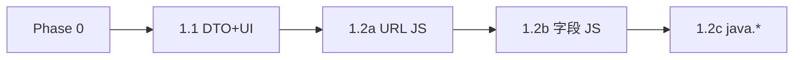

# Phase 1：短期（书源对齐 + JS）

> 返回 [ROADMAP](../ROADMAP.md) · 任务 [BACKLOG](../BACKLOG.md) · 预估 **2–3 周**

**目标**：书源可完整维护；支持 `@js:` URL 与基础 JS 规则字段。

**前置**：Phase 0 完成（Docker 稳定 + 书架/阅读器契约）。

## 1.1 书源管理前后端对齐（约 1 周）

### 任务

| 项 | 说明 | 文件 |
|----|------|------|
| BookSourceDTO | Legado 字段名 + 完整 rule/mode/cookie/headers/timeout/order | 计划 [`dto.go`](../internal/booksource/dto.go) |
| API | `GET/POST/PUT /api/bookSources` 返回/接收 DTO | [`handlers.go`](../internal/web/handlers.go) |
| 前端类型 | 与后端 1:1 | [`useStore.ts`](../web/src/store/useStore.ts) 或 `types/booksource.ts` |
| UI 双 Tab | 「简易」合集 JSON / 「高级」Monaco 四条 rule + 四 mode | [`BookSourceManage.tsx`](../web/src/pages/BookSourceManage.tsx) |
| 调试 | info / toc / content 四步测试 | [`BookSourceDebug.tsx`](../web/src/pages/BookSourceDebug.tsx) |

### 字段对照（节选）

| Legado JSON | 后端列 | 前端（目标） |
|-------------|--------|--------------|
| searchUrl | search_url | searchUrl |
| ruleSearch | search_rule | searchRule |
| bookUrl | book_info_url | bookInfoUrl |
| ruleBookInfo | book_info_rule | bookInfoRule |
| tocUrl | toc_url | tocUrl |
| ruleToc | toc_rule | tocRule |
| contentUrl | content_url | contentUrl |
| ruleContent | content_rule | contentRule |
| header | headers | headers (JSON string) |

### 验收

1. 编辑书源保存后**全字段回显**
2. 导入 26 源合集，管理页可见 searchUrl + 四条 rule
3. BookSourceDebug 四步均可返回非空（选手源）

## 1.2 JS 书源（约 1–2 周）

分三级交付，可拆 PR。

### 1.2a `@js:` searchUrl / bookUrl

| 项 | 说明 |
|----|------|
| 新文件 | [`internal/webbook/url_js.go`](../internal/webbook/url_js.go) |
| 集成 | `buildSearchURL` / bookUrl 构建调用 JsEngine |
| 扩展 | `JsExtensions` 绑定书源 HTTP client（Cookie/Headers） |

**验收**：含 `@js:` searchUrl 的书源可发起搜索（不要求全字段 JS 规则）。

### 1.2b 字段 `<js>` / `@js:`

| 项 | 说明 |
|----|------|
| 执行 | Executor 或 legado 路径调用 `JsEngine.RunEmbeddedJS` |
| 移除 | `hasUnsupportedJS` 硬阻断 |
| bookKey | `{sourceId}::{url\|jsResult}` |

**验收**：原先被阻断的 JS 搜索规则可返回结果。

### 1.2c Legado `java.*` 兼容层

优先级（文档固定，逐项实现）：

| 优先级 | API | 用途 |
|--------|-----|------|
| P1 | `java.ajax()` GET/POST | 大多数 JS 书源 |
| P1 | `java.getString()` / `java.put()` | 变量传递 |
| P2 | `java.base64Encode/Decode` | 编码书源 |
| P2 | `java.md5` / `java.sha256` | 签名 |
| P3 | `java.log()` | 调试 |

### 安全

- `JS_TIMEOUT_MS` 环境变量（默认 5000ms）
- 禁止文件 IO（goja 策略）
- ajax 域名建议限制在书源 `baseUrl` 子域

## 1.3 其他 Phase 1 项

| ID | 任务 | 文件 |
|----|------|------|
| P1-R01 | Cookie/Headers 注入 HTTP 请求 | [`webbook.go`](../internal/webbook/webbook.go) |
| P1-R02 | 书源导入错误反馈 UI | 配合 P0-E03 |
| P1-A01 | README/API 文档 `q` 参数 | [`README.md`](../README.md) |

## 完成定义

- [ ] 书源 CRUD 前后端字段 1:1
- [ ] 至少 1 个 `@js:` URL 书源搜索成功
- [ ] bookKey 规范在全链路统一
- [ ] LEGADO-COMPAT 中 Phase 1 项更新为 ✅/⚠️

## 依赖

