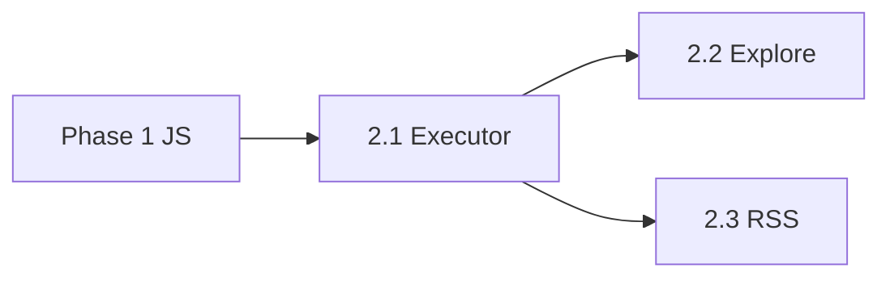

# Phase 2：中期（Executor + Explore + RSS）

> 返回 [ROADMAP](../ROADMAP.md) · 任务 [BACKLOG](../BACKLOG.md) · 预估 **3–4 周**

**目标**：统一规则引擎；书海发现；RSS 自定义 HTML 规则抓取。

**前置**：Phase 1 完成（JS URL + 书源字段对齐）。

## 2.1 RuleExecutor 统一（约 2 周）

### 实现

| 项 | 路径/说明 |
|----|-----------|
| Executor | [`internal/rule/executor.go`](../internal/rule/executor.go) — `Execute(ctx, mode, rule, body, vars)` |
| 组合 | 串联 `RuleAnalyzer` + `Query*` + `JsEngine` |
| 迁移 | webbook search/info/toc/content **全部**走 Executor |
| 清理 | deprecated [`legado_rule.go`](../internal/webbook/legado_rule.go) → 删除 |
| Mode | 读取书源 `searchMode/bookInfoMode/tocMode/contentMode` |
| Replace | [`replace/service.go`](../internal/replace/service.go) 按 `scope` 过滤后接入 content/title |

### 测试

- `testdata/legado/`：真实书源规则片段 fixture
- 快照测试：Execute 输出稳定
- 回归：26 源合集抽样 search/info/toc/content

### 验收

```bash
go test ./internal/rule/... -count=1
# 选手源 curl 四链路均非空
curl "localhost:6464/api/search?q=测试"
curl "localhost:6464/api/book/info?sourceId=1&bookKey=..."
curl "localhost:6464/api/book/toc?sourceId=1&bookKey=..."
curl "localhost:6464/api/book/content?sourceId=1&bookKey=...&chapterIndex=0"
```

## 2.2 书海 Explore（约 1–2 周）

### Schema

```sql
-- 方案 A：独立列
explore_url TEXT,
explore_rule TEXT,
explore_mode TEXT;

-- 方案 B：JSON explore_config
explore_config TEXT  -- {"url","rule","mode","tabs":[]}
```

### 后端

| 项 | 文件 |
|----|------|
| 导入映射 | [`import.go`](../internal/booksource/import.go) — `exploreUrl`, `ruleExplore` |
| API | `GET /api/explore?sourceId=&tab=` |
| 执行 | Explore 列表走 RuleExecutor |

### 前端

| 项 | 文件 |
|----|------|
| 新页 | [`web/src/pages/Explore.tsx`](../web/src/pages/Explore.tsx) |
| 路由 | [`router.tsx`](../web/src/router.tsx) |
| UI | 书源分组 Tab、封面网格、空态、跳转搜索/书架 |

### 验收

- 导入含 exploreUrl 的 Legado 源后，发现页展示分类 Tab
- 点击条目可进详情或加入书架

## 2.3 RSS 自定义规则（约 1–2 周）

### Schema

```sql
ALTER TABLE rss_feeds ADD COLUMN parse_rules TEXT;  -- JSON
-- feed_type 扩展: custom_html
```

### 后端

| 项 | 文件 |
|----|------|
| 导入持久化 | [`ConvertToFeed`](../internal/rss/import.go) — 保存 ruleArticles 等 |
| 抓取 | HTML + RuleExecutor |
| 创建源 | `createRSSFeed` 允许「仅规则、非标准 XML」 |
| GetRuleArticles | 实现非空返回 |

### 前端

- 规则编辑器（Monaco JSON / 字段表单）
- 抓取预览 10 条
- 可选：后台全文抓取 job

### 验收

- 导入 Legado RSS 合集后 `parse_rules` 非空
- 手动刷新可抓到文章列表
- `GetRuleArticles()` 返回规则内容

## 2.4 架构清理

| ID | 任务 | 说明 |
|----|------|------|
| T-018 | RSS DDL 迁出 booksource | [`internal/migrate/`](../internal/migrate/) |
| T-029 | 删除 parseRuleToSelectors | ✅ 已完成 |

## 完成定义

- [x] webbook 无独立 CSS 硬编码路径（四流程走 Executor + Legado 规则）
- [x] 替换规则 scope 生效
- [x] Explore 页可用
- [x] RSS 自定义规则端到端
- [x] ARCHITECTURE 目标数据流与实际一致

## 依赖



Explore 与 RSS 可并行，均依赖 Executor。
